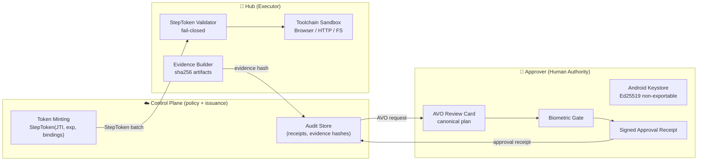

# KiLu Pocket Agent

**The end of god-mode agents.**
A split-trust mobile agent where **the cloud can think**, but **the phone can only act with cryptographic authority**.

> KiLu separates *brains* from *hands*:
> **Hub** executes in a constrained sandbox.
> **Approver** holds keys and confirms intent with biometrics.
> **Control Plane** enforces deterministic policy and issues single-use capability tokens.

---

## Current Status — Phase 10A ✅

This app is the **Android Approver + Hub** client for the KiLu Network.

| Component | Status |
|---|---|
| Approver pairing ceremony | ✅ Live |
| Task creation (free text + skill) | ✅ Live |
| Plan approval (biometric Ed25519 signing) | ✅ Live |
| Hub device registration + runtime binding | ✅ Live |
| Hub task queue polling | ✅ Live (Phase 10A: runtime-bound + grant-gated) |
| Step token minting via `mint-step-batch` | ✅ Live |
| Device list screen | ✅ Live |

**Backend:** [KiLu-Network](https://github.com/IkaRiche/KiLu-Network) — Cloud CP commit `3728d28` (31/31 tests green).

### Coming in Phase 10B
- Telegram Bot as conversational ingress (`telegram-bot/` in KiLu-Network)
- Android Approver remains the **only authority device** — Telegram does not approve tasks

---

## Why this exists

Most "agent frameworks" implicitly grant the LLM **god-mode**: unlimited tool access, long feedback loops, and unverifiable behavior.

KiLu is built for the opposite:
- **Authority is explicit** — capability tokens + human biometric signatures
- **Execution is constrained** — Hub refuses without cryptographic mandate
- **Outcomes are auditable** — evidence hashes + receipts, offline-verifiable

> KiLu does **not** rely on "trust the model". It relies on **cryptographic constraints**.

---

## Architecture (Zero-Trust Split-Trust)



---

## Three guarantees (with proof)

1. **Fail-closed** — without a valid StepToken, Hub refuses execution.
2. **Replay-proof** — each capability is single-use (JTI) and time-bounded (exp).
3. **Tamper-evident** — every output is bound to evidence hashes and receipts.

See [KiLu-Network/GUARANTEES.md](https://github.com/IkaRiche/KiLu-Network/blob/main/GUARANTEES.md).

---

## Quick Start (10 minutes)

### Prerequisites

- Two Android devices (or one device + emulator): **Hub** + **Approver**
- Running Control Plane: [KiLu-Network cloud/](https://github.com/IkaRiche/KiLu-Network/tree/main/cloud)

```bash
# Control Plane (local dev)
cd cloud && npm install && wrangler dev --local

# Android app
./gradlew assembleDevDebug
# Install on both Hub and Approver devices
```

### Pairing flow

1. **Approver** → Register as Approver (creates Ed25519 device identity)
2. **Approver** → Devices → "Pair a Hub" (generates QR code)
3. **Hub** → Scan QR → Confirm & Connect
4. **Hub** → Hub is now online and ready to receive tasks

---

## AVO Review Standard v0.5

The approval UI MUST display the following **without truncation**:

1. **Header**: verb + object (`e.g. "Execute: tracer echo"`)
2. **Target runtime**: Hub device and `runtime_id`
3. **Constraints**: max steps, allowed domains, time window
4. **Fingerprint**: `AVO#<base32(avo_hash[:5])>` — human-verifiable short code
5. **Risk badges**: External domain / High-risk / New scope

> **Hard deny:** if the app cannot render a known AVO template, approval is blocked. No silent fallback. This satisfies RT-05.

---

## Approval Receipt Signing

An `ApprovalReceipt` binds:
- `avo_hash` — SHA256 of canonical AVO bytes
- `decision_commitment` — from Trust Center decision
- `device_id`, `timestamp`, `receipt_id`
- **Signature**: Ed25519 over all above fields, Android Keystore, biometric required

---

## Device Keys

| Property | Current | Planned |
|---|---|---|
| Key generation | On-device Ed25519 | Same |
| Storage | EncryptedSharedPreferences (AES-256-SIV) | Android Keystore / StrongBox |
| Exportable | Yes (encrypted at rest) | No (hardware-backed) |
| Biometric required | Yes (for signing) | Yes |

---

## Related Repositories

- [KiLu-Network](https://github.com/IkaRiche/KiLu-Network) — Cloud Control Plane, Go runner, verifier, trust-center, Telegram bot
- [ROADMAP.md](https://github.com/IkaRiche/KiLu-Network/blob/main/ROADMAP.md) — Product specification v2.0 + shipped status

---

## License

Business Source License 1.1 — see [LICENSE](LICENSE).
