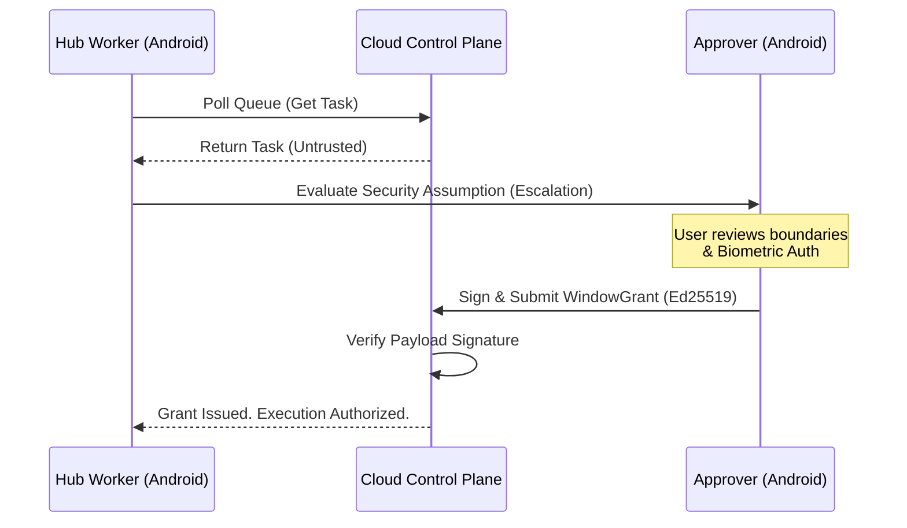

<div align="center">

# 📱 KiLu Pocket Agent

**The native Android client for the KiLu Network Cloud Control Plane.**

[](https://github.com/IkaRiche/kilu-pocket-agent/releases/latest)
[](https://github.com/IkaRiche/kilu-pocket-agent/actions)
[](https://kotlinlang.org)
[](https://www.android.com/)
[](LICENSE)

[Quickstart](#-quickstart-demo) • [Architecture](#-architecture) • [Security & Guarantees](GUARANTEES.md)

</div>

---

## 💡 The Vision: Split-Trust Mobile Data Extraction

**KiLu Pocket Agent** turns any Android device into an active node on the KiLu Network. It operates in a unique **Dual-Role System**, splitting trust between an administrative **Approver** (cryptographically signing operations) and an autonomous **Hub Runtime** (executing authorized web tasks).

**Three Core Promises:**
1. 🛡️ **Split-Trust Verification:** Hub workers cannot execute internet tasks without point-in-time cryptographic consent from the Approver.
2. ⛓️ **Hard Capability Bounds:** Executions are constrained at the network layer to explicitly whitelisted domains and methods.
3. 📜 **Tamper-Evident Ledgers:** All decisions and extracted data are deterministically signed, enabling verifiable audit trails.

> 📺 *[Insert 30-second Demo Video/GIF here showing the Attack → Block → Approve → Evidence flow]*

## 🚀 Quickstart: Demo

Want to see the Split-Trust mechanism in action? 

1. **Install the APK** from the [Latest Release](https://github.com/IkaRiche/kilu-pocket-agent/releases/latest).
2. **Open the Agent** and select the "Approver" role.
3. **Open the Agent on a second device** (or secondary profile) and select "Hub Worker".
4. **Scan to Pair:** Scan the Approver's QR code with the Hub device.

*Try triggering an unauthorized extraction task via the Cloud Control Plane API. Watch the Hub escalate the permission request to the Approver for biometric signature.*

## 🏗️ Architecture



The application is modularly structured to enforce separation of concerns and maintain a "thin client, thick cloud" philosophy:
*   **`core/`**: App-wide network utilities (OkHttp), state management, Encrypted Preferences (`DeviceProfileStore`), cryptographic operations, and QR scaffolding.
*   **`features/`**: Isolated UI domains (Onboarding, Pairing, Approver, Hub).
*   **`shared/`**: Strongly-typed Data Transfer Objects (DTOs) strictly mirroring Cloud Control Plane JSON schemas.

### 🔐 Security Posture

*   **Identities at Rest:** Currently leverages AndroidX Security Crypto (`EncryptedSharedPreferences`) mapped to AES-256-GCM. 
*   **Roadmap (v1.0):** Transitioning Ed25519 key generation strictly into the Android Hardware-Backed Keystore (non-exportable Secure Enclave keys).
*   **Network:** All interactions require dynamic execution tokens granted per-task and revoked upon completion. No persistent API tokens are stored on the Hub.

See [GUARANTEES.md](GUARANTEES.md) and [THREAT_MODEL.md](THREAT_MODEL.md) for full architectural proof schemas.

## 🎭 Dual-Role System

The Pocket Agent network relies on two distinct identities:

### 1. The Approver (Master Node)
The command center. 
* Generates a unique Ed25519 identity keypair anchored in the Android Keystore.
* Generates pairing QR codes to onboard Hub workers.
* Reviews incoming execution `Plan`s.
* Prompts the user for biometric authorization to sign execution boundaries (e.g., domain whitelists).
* Submits the cryptographic `WindowGrant` to the Cloud Control Plane.

### 2. The Hub (Execution Node)
The worker engine.
* Scans an Approver's QR Code to securely bind to a specific tenant identity.
* Polls the Control Plane for `READY_FOR_EXECUTION` tasks.
* Autonomously executes tasks sequentially.
* Escalates edge-case assumptions (like solving captchas or handling login prompts) back to the Approver.

## 🚀 Installation

### Download the Latest APK
You can always find the latest automatically built, signed, and hashed production APK in the [Releases](https://github.com/IkaRiche/kilu-pocket-agent/releases) tab.

### Build from Source
If you prefer to build the agent yourself:

```bash
# Clone the repository
git clone https://github.com/IkaRiche/kilu-pocket-agent.git
cd kilu-pocket-agent

# Build the development Debug APK
./gradlew assembleDevDebug

# (Optional) Build the Production Release APK
./gradlew assembleProdRelease
```

## 🔐 Security Model

**"Thin client, thick cloud."**

The Pocket Agent is intentionally designed to hold minimal state. 
* **No local billing logic**: All rate limiting, quota enforcement, and tier checking happens exclusively on the Cloud Control Plane.
* **No persistent API tokens**: Execution tokens are granted strictly per-task and revoked upon completion.
* **No key extraction**: Private keys never leave the Android Hardware-Backed Keystore. Signatures are generated entirely within the Secure Enclave.

## 🤝 Contributing

We welcome contributions! Please see our [Contributing Guidelines](CONTRIBUTING.md) for details on how to submit pull requests, report bugs, and suggest new features.

## 📄 License

This project is licensed under the MIT License - see the [LICENSE](LICENSE) file for details.

---
<div align="center">
  <sub>Built with ❤️ by the KiLu Network Team</sub>
</div>
