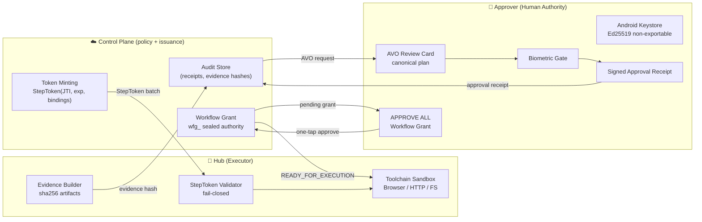

# KiLu Pocket Agent

Android authority device and validation runtime for KiLu's approval-bound execution model.

KiLu Pocket Agent demonstrates a live split-trust architecture in which planning and task creation can happen outside the device, but execution authority remains bound to explicit human approval, runtime-scoped grants, and evidence-backed completion.

This repository contains the Android components of that model:

- **Android Approver** — the human authority device
- **Android Hub** — the Android validation/runtime wedge for controlled execution

It is not the whole KiLu platform. The canonical operational system spans multiple repositories, with `KiLu-Network` acting as the main control-plane and ecosystem workspace.

---

## Current Status

**Current phase:** E3.2 — Workflow Grant Orchestration  
**E3.2 Phase B status:** ✅ COMPLETE (2026-04-11)  
**Proven:** B9 (happy path) + B10 (revoke path) — both live-verified on device

What has been proven on a live runtime:

- QR pairing between Approver and Hub
- runtime-bound grants and approval-gated execution
- end-to-end task flow: create → approve → execute → DONE
- Telegram DONE notifications with human-readable result preview
- TaskDetailScreen with real task result, execution facts, and evidence preview
- **[E3.2-B] Real CP-backed workflow grants with one-tap Android APPROVE ALL**
- **[E3.2-B] Sealed `workflow_ref` with server-side tamper detection**
- **[E3.2-B] Atomic `PLANNING → READY_FOR_EXECUTION` for all tasks on approve**
- **[E3.2-B] Revoke-on-failure: bridge revokes grant, remaining steps do not execute**

---

## Recent Milestones

- **E3.2 Phase B COMPLETE** (2026-04-11) — Real workflow grant, one-tap approval, revoke proof
- R1-final closed: clean D1 lifecycle, stable runtime heartbeat, control E2E confirmed
- Telegram DONE notifications confirmed on live tasks
- TaskDetailScreen implemented and device-verified with real evidence-backed task data
- ecosystem docs aligned across KiLu-Network, kilu-pocket-agent, and kilu-sdk

See [E3_2_PHASE_B_MILESTONE.md](E3_2_PHASE_B_MILESTONE.md) for full proof record.

---

## What This Repository Is

This repository is the **Android reference implementation** of KiLu's approval-bound execution model.

It is the place where KiLu's core ideas are made visible on-device:

- human approval as a first-class authority primitive
- runtime-bound execution instead of free-floating agent autonomy
- fail-closed behavior when authority or bindings do not match
- evidence-aware task completion rather than opaque background execution

---

## What This Repository Is Not

This repository should **not** be read as the entire KiLu platform, and it should **not** be interpreted as claiming that Android is the final production runtime for broad agent workloads.

More precisely:

- **Android Approver** is the authority device
- **Android Hub** is the current validation/runtime wedge
- broader production execution is expected to evolve through Linux/gateway runtimes and external agent integrations
- public integration for external agents belongs to the KiLu SDK and related control-plane repos
- multi-hub routing and partial retry are **not** part of the current scope

---

## Proven Validation Scope

The Android path is now validated for:

- approval-gated task execution
- runtime-bound execution targeting
- result + evidence return to the control plane
- human-visible completion via Telegram
- on-device task inspection through TaskDetailScreen
- **workflow grant: one-tap atomic approval of a pre-sealed multi-step workflow**
- **workflow grant: revoke-on-failure — no continued execution after step failure**

This means the Android wedge is already useful as a live validation surface and reference implementation.

It does **not** mean that the Android Hub is presented as the final answer for all future execution environments.

---

## Repository Role in the KiLu Ecosystem

This repository is best understood as:

- **Authority device:** Android Approver
- **Validation/runtime wedge:** Android Hub
- **Reference UX surface:** approval, task state, evidence preview
- **Demonstration vehicle:** the most concrete public proof of KiLu's split-trust architecture

---

## Architecture (Split-Trust)



---

## Four Guarantees

1. **Fail-closed** — without a valid StepToken or workflow grant, Hub refuses execution.
2. **Replay-proof** — each capability is single-use (JTI) and time-bounded (exp).
3. **Tamper-evident** — every output is bound to evidence hashes and receipts.
4. **Revoke-on-failure** — a mid-workflow step failure revokes the grant; remaining steps do not execute.

See [GUARANTEES.md](GUARANTEES.md).

---

## Quick Start (10 minutes)

### Prerequisites

- Two Android devices (or one device + emulator): **Hub** + **Approver**
- Running Control Plane: [KiLu-Network/cloud](https://github.com/IkaRiche/KiLu-Network/tree/main/cloud)

```bash
# Build debug APK (requires Java 17+)
./gradlew assembleDevDebug

# Install on both Hub and Approver devices
adb install -r app/build/outputs/apk/dev/debug/kilu-agent-dev-v*.apk
```

### Pairing Flow

1. **Approver** → Register as Approver (creates Ed25519 device identity)
2. **Approver** → Devices → "Pair a Hub" (generates QR code)
3. **Hub** → Scan QR → Confirm & Connect
4. Hub is now online and ready to receive tasks

---

## AVO Review Standard v0.5

The approval UI MUST display the following **without truncation**:

1. **Header**: verb + object (`e.g. "Execute: fetch orf.at"`)
2. **Target runtime**: Hub device and `runtime_id`
3. **Constraints**: max steps, allowed domains, time window
4. **Fingerprint**: `AVO#<base32(avo_hash[:5])>` — human-verifiable short code
5. **Risk badges**: External domain / High-risk / New scope

> **Hard deny:** if the app cannot render a known AVO template, approval is blocked. No silent fallback.

---

## Approval Receipt Signing

An `ApprovalReceipt` binds:
- `avo_hash` — SHA256 of canonical AVO bytes
- `decision_commitment` — from Trust Center decision
- `device_id`, `timestamp`, `receipt_id`
- **Signature**: Ed25519 over all above fields, Android Keystore, biometric required

---

## Governance & Project Status

Project-level governance and phase tracking live in the canonical repository:

| Document | Location |
|---|---|
| STATUS.md | [KiLu-Network/STATUS.md](https://github.com/IkaRiche/KiLu-Network/blob/main/STATUS.md) |
| KNOWN_GOOD_BASELINES.md | [KiLu-Network/KNOWN_GOOD_BASELINES.md](https://github.com/IkaRiche/KiLu-Network/blob/main/KNOWN_GOOD_BASELINES.md) |
| GOVERNANCE.md | [KiLu-Network/GOVERNANCE.md](https://github.com/IkaRiche/KiLu-Network/blob/main/GOVERNANCE.md) |

---

## Related Repositories

- **[KiLu-Network](https://github.com/IkaRiche/KiLu-Network)** — canonical operational repo for the control plane, Telegram bot, bridge logic, lifecycle docs, and ecosystem governance
- **[kilu-sdk](https://github.com/IkaRiche/kilu-sdk)** — public TypeScript SDK for integrating external planners and agents into KiLu's authority model (`@kilu/sdk`, `KiluClient`, `submitIntent`, `verifyReceipt`)
- **[KiLu](https://github.com/IkaRiche/KiLu)** — DeTAK (Deterministic Transaction & Authority Kernel) — protocol and authority primitives

---

## Practical Reading Guide

If you are trying to understand the project quickly:

- read this repository to understand the Android authority device and validation runtime
- read `KiLu-Network` to understand the live operational flow
- read `kilu-sdk` to understand the external integration surface

---

## Core Thesis

Agents may plan.  
KiLu authorizes.  
Execution happens only within explicit, runtime-bound, human-approved limits.

---

## License

Business Source License 1.1 — see [LICENSE](LICENSE).
