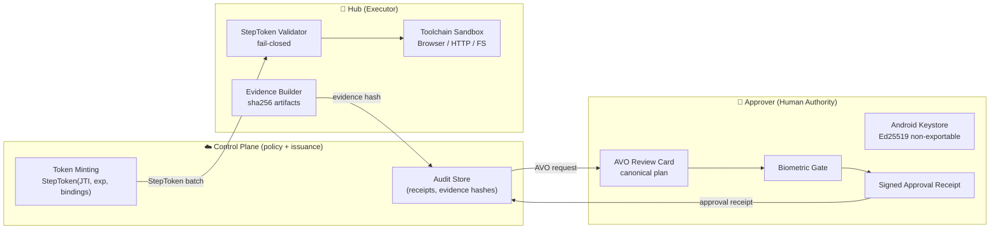

# kilu-pocket-agent

**kilu-pocket-agent is the Android authority device and validation runtime for KiLu's approval-bound execution model.**

It demonstrates live split-trust execution: human approval via biometrics, runtime-bound grants, and evidence-backed task completion. Broader production execution is expected to evolve through Linux/gateway runtimes and external agent integrations.

> KiLu separates *authority* from *execution*:  
> **Approver** holds keys and confirms intent with biometrics.  
> **Hub** executes in a constrained sandbox — only what it was explicitly granted.  
> **Control Plane** issues single-use capability tokens and enforces deterministic policy.

---

## Current Status — R2 ✅

**2026-03-23 — device-verified.**

| Milestone | Status | Date |
|---|---|---|
| R1 — E2E baseline confirmed | ✅ Closed | 2026-03-23 |
| R2 — TaskDetailScreen (4-section evidence view) | ✅ Device-verified | 2026-03-23 |
| Live E2E smoke test (3/3 runs) | ✅ Confirmed | 2026-03-23 |
| Android runtime | ✅ Validated | Validation/wedge role |
| Linux/gateway runtime | 🔲 Planned | Production execution path |

**Full operator cycle proven:**  
Task creation → human approval → runtime-bound execution → evidence result → DONE notification → TaskDetail evidence view.

---

## What This Repo Contains

| Component | Role | Status |
|---|---|---|
| **Android Approver** | Human authority device — biometric approval, Ed25519 keys, AVO review | ✅ Live |
| **Android Hub** | Validation runtime — bounded HTML fetch, step-token execution, evidence submission | ✅ Live (validation) |
| **TaskDetailScreen** | Evidence view — url, summary, headings, runtime_id, execution timeline | ✅ R2 device-verified |

---

## Scope Clarification

**Android Approver** is a production-grade authority device. It holds non-exportable Ed25519 keys in Android Keystore, presents canonical AVO review cards, and issues biometric-signed approval receipts. This role is designed for permanent use.

**Android Hub** is a validation runtime. It proves the execution model works end-to-end on a constrained device: bounded HTML fetch, adapter-based toolchain, step-token validation, evidence generation. It is **not** positioned as the final production executor for broad or compute-heavy workloads.

**Production execution direction** is Linux Hub and gateway runtimes — where network access, process isolation, and resource limits can be properly managed.

**kilu-sdk** ([`@kilu/sdk`](https://github.com/IkaRiche/kilu-sdk)) is the public TypeScript integration surface. It is live — not a future plan.

**KiLu-Network** is the canonical private monorepo: Control Plane, Telegram Bot, governance docs, phase tracking.

---

## What KiLu Is

KiLu is an **authority fabric** for agentic execution:

- **Grants** — structured, time-bounded permission objects
- **Runtime binding** — execution is cryptographically tied to a specific device
- **Human approval** — biometric signature required before any step runs
- **Constrained execution** — Hub refuses without valid capability token
- **Evidence** — every outcome is hash-bound and auditable

> KiLu does **not** rely on "trust the model". It relies on **cryptographic constraints**.

---

## Architecture (Split-Trust)



---

## Three Guarantees

1. **Fail-closed** — without a valid StepToken, Hub refuses execution.
2. **Replay-proof** — each capability is single-use (JTI) and time-bounded (exp).
3. **Tamper-evident** — every output is bound to evidence hashes and receipts.

See [GUARANTEES.md](GUARANTEES.md).

---

## Confirmed Baseline — 2026-03-23

**Smoke test:** 3 consecutive runs — no D1 edits, no restarts, no re-pairing.

| Run | Site | DONE |
|-----|------|------|
| 1 | klimacoach.com | ✅ |
| 2 | orf.at | ✅ |
| 3 | bbc.com | ✅ |

Baseline tag: `r1-core-stable-2026-03-23`

---

## Quick Start (10 minutes)

### Prerequisites

- Two Android devices (or one device + emulator): **Hub** + **Approver**
- Running Control Plane: [KiLu-Network/cloud](https://github.com/IkaRiche/KiLu-Network/tree/main/cloud)

```bash
# Build debug APK (requires Java 17+)
./gradlew assembleDevDebug

# Install on both Hub and Approver devices
adb install -r app/build/outputs/apk/dev/debug/kilu-agent-dev-v*.apk
```

### Pairing Flow

1. **Approver** → Register as Approver (creates Ed25519 device identity)
2. **Approver** → Devices → "Pair a Hub" (generates QR code)
3. **Hub** → Scan QR → Confirm & Connect
4. Hub is now online and ready to receive tasks

---

## AVO Review Standard v0.5

The approval UI MUST display the following **without truncation**:

1. **Header**: verb + object (`e.g. "Execute: fetch orf.at"`)
2. **Target runtime**: Hub device and `runtime_id`
3. **Constraints**: max steps, allowed domains, time window
4. **Fingerprint**: `AVO#<base32(avo_hash[:5])>` — human-verifiable short code
5. **Risk badges**: External domain / High-risk / New scope

> **Hard deny:** if the app cannot render a known AVO template, approval is blocked. No silent fallback.

---

## Approval Receipt Signing

An `ApprovalReceipt` binds:
- `avo_hash` — SHA256 of canonical AVO bytes
- `decision_commitment` — from Trust Center decision
- `device_id`, `timestamp`, `receipt_id`
- **Signature**: Ed25519 over all above fields, Android Keystore, biometric required

---

## Governance & Project Status

This repository is the **Android authority layer** of KiLu.  
Project-level governance and phase tracking live in the canonical repository:

| Document | Location |
|---|---|
| STATUS.md | [KiLu-Network/STATUS.md](https://github.com/IkaRiche/KiLu-Network/blob/main/STATUS.md) |
| KNOWN_GOOD_BASELINES.md | [KiLu-Network/KNOWN_GOOD_BASELINES.md](https://github.com/IkaRiche/KiLu-Network/blob/main/KNOWN_GOOD_BASELINES.md) |
| GOVERNANCE.md | [KiLu-Network/GOVERNANCE.md](https://github.com/IkaRiche/KiLu-Network/blob/main/GOVERNANCE.md) |

**Current phase:** R2 — Android Wedge Packaging  
**R1 closed:** ✅ 2026-03-23 — E2E 3/3 confirmed, D1 cleaned, `registerRuntime` fixed  
**R2:** ✅ TaskDetailScreen device-verified — 4-section evidence view (url / summary / headings / runtime timeline)

---

## Related Repositories

- [KiLu-Network](https://github.com/IkaRiche/KiLu-Network) — Control Plane, Telegram Bot, governance docs, phase tracking (canonical operational repo)
- [kilu-sdk](https://github.com/IkaRiche/kilu-sdk) — TypeScript SDK: `KiluClient`, `submitIntent`, `verifyReceipt` (`@kilu/sdk`) — live, not planned
- [KiLu](https://github.com/IkaRiche/KiLu) — DeTAK (Deterministic Transaction & Authority Kernel) — protocol core

---

## License

Business Source License 1.1 — see [LICENSE](LICENSE).
