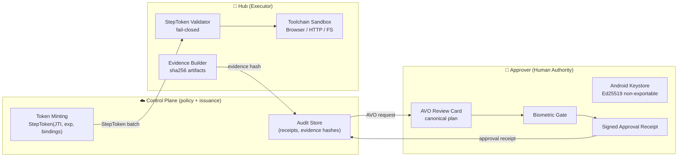

# KiLu Pocket Agent

**Approval-bound execution layer for AI agents.**  
A split-trust system where **the cloud orchestrates**, **the phone authorizes**, and **the Hub executes only with cryptographic mandate**.

> KiLu separates *brains* from *hands*:  
> **Hub** executes in a constrained sandbox — only what it was explicitly granted.  
> **Approver** holds keys and confirms intent with biometrics.  
> **Control Plane** issues single-use capability tokens and enforces deterministic policy.

---

## Confirmed Baseline — 2026-03-23 ✅

**Full end-to-end path confirmed working on live runtime.**

| Layer | Component | Status |
|---|---|---|
| Interface | Telegram Bot (task creation) | ✅ Live |
| Authority | Android Approver (biometric Ed25519) | ✅ Live |
| Execution | Android Hub (validation runtime) | ✅ Live |
| Notification | Telegram DONE notification | ✅ Confirmed |

**Smoke test:** 3 consecutive runs — no D1 edits, no restarts, no re-pairing.

| Run | Site | DONE |
|-----|------|------|
| 1 | klimacoach.com | ✅ |
| 2 | orf.at | ✅ |
| 3 | bbc.com | ✅ |

**What this means:** The full operator cycle — task creation → human approval → execution → result → human-visible DONE notification — is proven end-to-end. This is not a prototype showing one path in isolation.

---

## What KiLu Is

KiLu is an **authority fabric** for agentic execution:

- **Grants** — structured, time-bounded permission objects
- **Runtime binding** — execution is cryptographically tied to a specific device
- **Human approval** — biometric signature required before any step runs
- **Constrained execution** — Hub refuses without valid capability token
- **Evidence** — every outcome is hash-bound and auditable

> KiLu does **not** rely on "trust the model". It relies on **cryptographic constraints**.

---

## Runtime Classification

| Runtime | Role | Status |
|---|---|---|
| Android Hub | Validation runtime — E2E proof, demos | ✅ Confirmed working |
| Android Approver | Human authority device — production | ✅ Confirmed working |
| Linux Hub | Production execution path | 🔵 Planned (R2) |
| SDK adapters | [`kilu-sdk`](https://github.com/IkaRiche/kilu-sdk) — wrap existing agents (TypeScript) | ✅ Shipped v0.1 |

**Android Hub is validation, not production.** The production execution path is Linux Hub. Android proves the authority model works; Linux will carry production load.

---

## Why This Exists

Most "agent frameworks" implicitly grant the LLM **god-mode**: unlimited tool access, long feedback loops, and unverifiable behavior.

KiLu is built for the opposite:
- **Authority is explicit** — capability tokens + human biometric signatures
- **Execution is constrained** — Hub refuses without cryptographic mandate
- **Outcomes are auditable** — evidence hashes + receipts, offline-verifiable
- **The model is never trusted** — KiLu wraps any agent and constrains it

---

## Architecture (Split-Trust)



---

## Three Guarantees

1. **Fail-closed** — without a valid StepToken, Hub refuses execution.
2. **Replay-proof** — each capability is single-use (JTI) and time-bounded (exp).
3. **Tamper-evident** — every output is bound to evidence hashes and receipts.

See [GUARANTEES.md](GUARANTEES.md).

---

## Quick Start (10 minutes)

### Prerequisites

- Two Android devices (or one device + emulator): **Hub** + **Approver**
- Running Control Plane: [KiLu-Network/cloud](https://github.com/IkaRiche/KiLu-Network/tree/main/cloud)

```bash
# Android app
./gradlew assembleDevDebug
# Install on both Hub and Approver devices
```

### Pairing Flow

1. **Approver** → Register as Approver (creates Ed25519 device identity)
2. **Approver** → Devices → "Pair a Hub" (generates QR code)
3. **Hub** → Scan QR → Confirm & Connect
4. Hub is now online and ready to receive tasks

---

## AVO Review Standard v0.5

The approval UI MUST display the following **without truncation**:

1. **Header**: verb + object (`e.g. "Execute: fetch orf.at"`)
2. **Target runtime**: Hub device and `runtime_id`
3. **Constraints**: max steps, allowed domains, time window
4. **Fingerprint**: `AVO#<base32(avo_hash[:5])>` — human-verifiable short code
5. **Risk badges**: External domain / High-risk / New scope

> **Hard deny:** if the app cannot render a known AVO template, approval is blocked. No silent fallback.

---

## Approval Receipt Signing

An `ApprovalReceipt` binds:
- `avo_hash` — SHA256 of canonical AVO bytes
- `decision_commitment` — from Trust Center decision
- `device_id`, `timestamp`, `receipt_id`
- **Signature**: Ed25519 over all above fields, Android Keystore, biometric required

---

## Governance & Project Status

This repository is the **Android authority layer** of KiLu.  
Project-level governance and phase tracking live in the main repository:

| Document | Location |
|---|---|
| STATUS.md | [KiLu-Network/STATUS.md](https://github.com/IkaRiche/KiLu-Network/blob/main/STATUS.md) |
| KNOWN_GOOD_BASELINES.md | [KiLu-Network/KNOWN_GOOD_BASELINES.md](https://github.com/IkaRiche/KiLu-Network/blob/main/KNOWN_GOOD_BASELINES.md) |
| GOVERNANCE.md | [KiLu-Network/GOVERNANCE.md](https://github.com/IkaRiche/KiLu-Network/blob/main/GOVERNANCE.md) |

**Current phase:** R2 — Android Wedge Packaging  
**R0 closed:** 2026-03-22  
**R1 closed:** ✅ 2026-03-23 — E2E 3/3 confirmed, D1 cleaned, `registerRuntime` fixed  
**R2 active:** TaskDetailScreen (real evidence preview)

---

## Related Repositories

- [KiLu-Network](https://github.com/IkaRiche/KiLu-Network) — Cloud Control Plane, Telegram Bot, governance docs, phase tracking
- [kilu-sdk](https://github.com/IkaRiche/kilu-sdk) — TypeScript SDK: `KiluClient`, intent submission, receipt verification (`@kilu/sdk`)
- [KiLu](https://github.com/IkaRiche/KiLu) — DeTAK (Deterministic Transaction & Authority Kernel) — protocol core

---

## License

Business Source License 1.1 — see [LICENSE](LICENSE).
